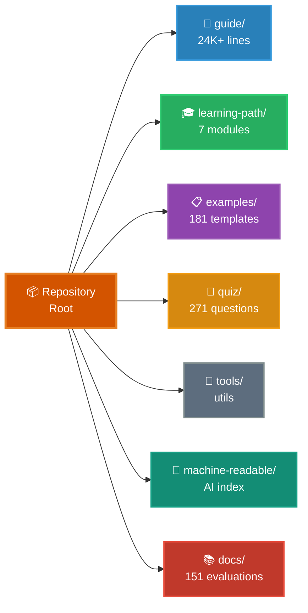

# Claude Code Ultimate Guide

<!-- Website CTA -->
<p align="center">
  <a href="https://florianbruniaux.github.io/claude-code-ultimate-guide-landing/"></a>
</p>

<!-- Stats -->
<p align="center">
  <a href="https://github.com/FlorianBruniaux/claude-code-ultimate-guide/stargazers"></a>
  <a href="./CHANGELOG.md"></a>
  <a href="./quiz/"></a>
  <a href="./examples/"></a>
</p>

<!-- Features -->
<p align="center">
  <a href="./guide/security/security-hardening.md"></a>
  <a href="./mcp-server/"></a>
</p>

<!-- Downloads -->
<p align="center">
  <a href="https://github.com/FlorianBruniaux/claude-code-ultimate-guide/releases/latest/download/guide-export.pdf"></a>
  <a href="https://github.com/FlorianBruniaux/claude-code-ultimate-guide/releases/latest/download/guide-export.epub"></a>
</p>

<!-- Meta -->
<p align="center">
  <a href="https://github.com/hesreallyhim/awesome-claude-code"></a>
  <a href="https://creativecommons.org/licenses/by-sa/4.0/"></a>
  <a href="https://skills.palebluedot.live/owner/FlorianBruniaux"></a>
  <a href="https://zread.ai/FlorianBruniaux/claude-code-ultimate-guide"></a>
</p>

> **6 months of daily practice** distilled into a guide that teaches you the WHY, not just the what. From core concepts to production security, you learn to design your own agentic workflows instead of copy-pasting configs.

> **If this guide helps you, [give it a star ⭐](https://github.com/FlorianBruniaux/claude-code-ultimate-guide/stargazers)** — it helps others discover it too.

---

## StarMapper

<a href="https://starmapper.bruniaux.com/FlorianBruniaux/claude-code-ultimate-guide">
  <picture>
    <source media="(prefers-color-scheme: dark)" srcset="https://starmapper.bruniaux.com/api/map-image/FlorianBruniaux/claude-code-ultimate-guide?theme=dark" />
    <source media="(prefers-color-scheme: light)" srcset="https://starmapper.bruniaux.com/api/map-image/FlorianBruniaux/claude-code-ultimate-guide?theme=light" />
    
  </picture>
</a>

---

## Choose Your Path

| Who you are | Your guide |
|---|---|
| 🏗️ **Tech Lead / Engineering Manager** | [Deploying Claude Code across your team →](docs/for-tech-leads.md) |
| 📊 **CTO / Decision Maker** | [ROI, security posture, team adoption →](docs/for-cto.md) |
| 💼 **CIO / CEO** | [Budget, risk, what to ask your tech team (3 min) →](docs/for-cio-ceo.md) |
| 🎨 **Product Manager / Designer** | [Vibe coding, working with AI-assisted dev teams →](docs/for-product-managers.md) |
| ✍️ **Writer / Ops / Manager** | [Claude Cowork Guide (separate repo) →](https://github.com/FlorianBruniaux/claude-cowork-guide) |
| 👨‍💻 **Developer (all levels)** | You're in the right place — read on ↓ |
| 🧭 **Career pivot / new AI role** | [AI Roles & Career Paths →](guide/roles/ai-roles.md) |

---

## 🎯 What You'll Learn

**This guide teaches you to think differently about AI-assisted development:**
- ✅ **Understand trade-offs** — When to use agents vs skills vs commands (not just how to configure them)
- ✅ **Build mental models** — How Claude Code works internally (architecture, context flow, tool orchestration)
- ✅ **Visualize concepts** — 48 Mermaid diagrams covering model selection, master loop, memory hierarchy, multi-agent patterns, security threats, AI fluency paths
- ✅ **Master methodologies** — TDD, SDD, BDD with AI collaboration (not just templates)
- ✅ **Security mindset** — Threat modeling for AI systems (only guide with 28 CVEs + 655 malicious skills database)
- ✅ **Test your knowledge** — 271-question quiz to validate understanding (no other resource offers this)

**Outcome**: Go from copy-pasting configs to designing your own agentic workflows with confidence.

---

## 📊 When to Use This Guide vs Everything-CC

Both guides serve different needs. Choose based on your priority.

| Your Goal | This Guide | everything-claude-code |
|-----------|------------|------------------------|
| **Understand why** patterns work | Deep explanations + architecture | Config-focused |
| **Quick setup** for projects | Available but not the priority | Battle-tested production configs |
| **Learn trade-offs** (agents vs skills) | Decision frameworks + comparisons | Lists patterns, no trade-off analysis |
| **Security hardening** | Only threat database (28 CVEs) | Basic patterns only |
| **Test understanding** | 271-question quiz | Not available |
| **Methodologies** (TDD/SDD/BDD) | Full workflow guides | Not covered |
| **Copy-paste ready** templates | 181 templates | 200+ templates |

### Ecosystem Positioning

```
                    EDUCATIONAL DEPTH
                           ▲
                           │
                           │  ★ This Guide
                           │  Security + Methodologies + 24K+ lines
                           │
                           │  [Everything-You-Need-to-Know]
                           │  SDLC/BMAD beginner
  ─────────────────────────┼─────────────────────────► READY-TO-USE
  [awesome-claude-code]    │            [everything-claude-code]
  (discovery, curation)    │            (plugin, 1-cmd install)
                           │
                           │  [claude-code-studio]
                           │  Context management
                           │
                      SPECIALIZED
```

**5 unique gaps no competitor covers:**
1. **Security-First** — 28 CVEs + 655 malicious skills tracked (no competitor has this depth)
2. **Methodology Workflows** — TDD/SDD/BDD comparison + step-by-step guides
3. **Comprehensive Reference** — 24K+ lines across 16 specialized guides (24× more reference material than everything-cc)
4. **Educational Progression** — 271-question quiz + 7-module structured learning path (beginner → advanced)
5. **Interactive Assessment** — `/self-assessment` skill with personalized learning path recommendations

**Recommended workflow:**
1. Learn concepts here (mental models, trade-offs, security)
2. Use battle-tested configs there (quick project setup)
3. Return here for deep dives (when something doesn't work or to design custom workflows)

**Both resources are complementary, not competitive.** Use what fits your current need.

---

## ⚡ Quick Start

**New to Claude Code?** → [**7-Module Learning Path**](./guide/learning-path/README.md) — 8-11 hours, beginner to advanced

**Quickest path**: [Cheat Sheet](./guide/cheatsheet.md) — 1 printable page with daily essentials

**Interactive onboarding** (no setup needed):
```bash
claude "Fetch and follow the onboarding instructions from: https://raw.githubusercontent.com/FlorianBruniaux/claude-code-ultimate-guide/main/tools/onboarding-prompt.md"
```

**Browse directly**: [Full Guide](./guide/ultimate-guide.md) | [Learning Path](./guide/learning-path/) | [Visual Diagrams](./guide/diagrams/) | [Examples](./examples/) | [Quiz](./quiz/)

---

## 🔌 MCP Server — Use the guide from any Claude Code session

No cloning needed. Add to `~/.claude.json` and ask questions directly from any session:

```json
{
  "mcpServers": {
    "claude-code-guide": {
      "type": "stdio",
      "command": "npx",
      "args": ["-y", "claude-code-ultimate-guide-mcp"]
    }
  }
}
```

17 tools: `search_guide`, `read_section`, `get_cheatsheet`, `get_digest`, `get_example`, `list_examples`, `search_examples`, `get_release`, `get_changelog`, `compare_versions`, `list_topics`, `get_threat`, `list_threats`, plus `init_official_docs`, `refresh_official_docs`, `diff_official_docs`, `search_official_docs` (v1.1.0 — official Anthropic docs tracker) — plus 13 slash commands `/ccguide:*` and a Haiku agent.

**Onboarding one-liner** (once MCP is configured):
```bash
claude "Use the claude-code-guide MCP server. Activate the claude-code-expert prompt, then run a personalized onboarding: ask me 3 questions about my goal, experience level, and preferred tone — then build a custom learning path using search_guide and read_section to navigate the guide with live source links."
```

→ [MCP Server README](./mcp-server/README.md)

---

## 📁 Repository Structure



<details>
<summary><strong>Detailed Structure (Text View)</strong></summary>

```
📦 claude-code-ultimate-guide/
│
├─ 📖 guide/              Core Documentation (24K+ lines)
│  ├─ learning-path/      7-Module Learning Path (beginners → advanced)
│  ├─ ultimate-guide.md   Complete reference, 10 sections
│  ├─ cheatsheet.md       1-page printable
│  ├─ architecture.md     How Claude Code works internally
│  ├─ methodologies.md    TDD, SDD, BDD workflows
│  ├─ diagrams/           48 Mermaid diagrams (10 thematic files)
│  ├─ third-party-tools.md  Community tools (RTK, ccusage, Entire CLI)
│  ├─ mcp-servers-ecosystem.md  Official & community MCP servers
│  └─ workflows/          Step-by-step guides
│
├─ 📋 examples/           181 Production Templates
│  ├─ CATALOG.md          Auto-generated index by complexity, time, domain
│  ├─ agents/             23 custom AI personas
│  ├─ commands/           redirect stubs (migrated to skills/ in CC 2.1.3)
│  ├─ hooks/              37 hooks (bash + PowerShell)
│  ├─ skills/             64 skills (9 on SkillHub)
│  └─ scripts/            Utility scripts (audit, search)
│
├─ 🧠 quiz/               271 Questions
│  ├─ 9 categories        Setup, Agents, MCP, Trust, Advanced...
│  ├─ 4 profiles          Junior, Senior, Power User, PM
│  └─ Instant feedback    Doc links + score tracking
│
├─ 🔧 tools/              Interactive Utilities
│  ├─ onboarding-prompt   Personalized guided tour
│  └─ audit-prompt        Setup audit & recommendations
│
├─ 🤖 machine-readable/   AI-Optimized Index
│  ├─ reference.yaml      Structured index (~2K tokens) — powers landing site CMD+K search
│  ├─ claude-code-releases.yaml  Structured releases changelog
│  └─ llms.txt            Standard LLM context file
│
└─ 📚 docs/               151 Resource Evaluations
   └─ resource-evaluations/  5-point scoring, source attribution
```

</details>

---

## 🎯 What Makes This Guide Unique

### 🎓 Deep Understanding Over Configuration

**Outcome**: Design your own workflows instead of copy-pasting blindly.

**We teach how Claude Code works and why patterns matter**:
- [Tools Reference](./guide/core/tools-reference.md): all 40 built-in tools, permission rule formats, per-tool behaviors (timeouts, file-read limits, lossy WebFetch), and how-to for Monitor, Workflow, agent teams, Cron, Tasks API
- [Architecture](./guide/core/architecture.md) — Internal mechanics (context flow, tool orchestration, memory management)
- [Trade-offs](./guide/ultimate-guide.md#when-to-use-what) — Decision frameworks for agents vs skills vs commands
- [Configuration Decision Guide](./guide/ultimate-guide.md#27-configuration-decision-guide) — Unified "which mechanism for what?" map across all 7 config layers
- [Pitfalls](./guide/ultimate-guide.md#common-mistakes) — Common failure modes + prevention strategies

**What this means for you**: Troubleshoot issues independently, optimize for your specific use case, know when to deviate from patterns.

---

### 🖼️ Visual Diagrams Series (48 Mermaid Diagrams)

**Outcome**: Grasp complex concepts instantly through visual mental models.

**48 interactive diagrams** across 10 thematic files — GitHub-native Mermaid rendering + ASCII fallback for every diagram:
- [Foundations](./guide/diagrams/01-foundations.md) — 4-layer context model, 9-step pipeline, permission modes
- [Architecture](./guide/diagrams/04-architecture-internals.md) — Master loop, tool categories, system prompt assembly
- [Multi-Agent](./guide/diagrams/07-multi-agent-patterns.md) — 3 topologies, worktrees, dual-instance, horizontal scaling
- [Security](./guide/diagrams/08-security-and-production.md) — 3-layer defense, MCP rug pull attack chain, verification paradox
- [Cost & Models](./guide/diagrams/09-cost-and-optimization.md) — Model selection tree, token reduction pipeline

[Browse all 48 diagrams →](./guide/diagrams/)

**What this means for you**: Understand the master loop before reading 24K+ lines, see multi-agent topologies at a glance, share visual security threat models with your team.

---

### 🛡️ Security Threat Intelligence (Only Comprehensive Database)

**Outcome**: Protect production systems from AI-specific attacks.

**Only guide with systematic threat tracking**:
- **28 CVE-mapped vulnerabilities** — Prompt injection, data exfiltration, code injection
- **655 malicious skills catalogued** — Unicode injection, hidden instructions, auto-execute patterns
- **Production hardening workflows** — MCP vetting, injection defense, audit automation

[Threat Database →](./examples/skills/update-threat-db/threat-db.yaml) | [Security Guide →](./guide/security/security-hardening.md)

**What this means for you**: Vet MCP servers before trusting them, detect attack patterns in configs, comply with security audits.

---

### 📝 271-Question Knowledge Validation (Unique in Ecosystem)

**Outcome**: Verify your understanding + identify knowledge gaps.

**Only comprehensive assessment available** — test across 9 categories:
- Setup & Configuration, Agents & Sub-Agents, MCP Servers, Trust & Verification, Advanced Patterns

**Features**: 4 skill profiles (Junior/Senior/Power User/PM), instant feedback with doc links, weak area identification

[Try Quiz Online →](https://florianbruniaux.github.io/claude-code-ultimate-guide-landing/quiz/) | [Run Locally](./quiz/)

**What this means for you**: Know what you don't know, track learning progress, prepare for team adoption discussions.

---

### 🤖 Agent Teams Coverage (v2.1.32+ Experimental)

**Outcome**: Parallelize work on large codebases (Fountain: 50% faster, CRED: 2x speed).

**Only comprehensive guide to Anthropic's multi-agent coordination**:
- Production metrics from real companies (autonomous C compiler, 500K hours saved)
- 5 validated workflows (multi-layer review, parallel debugging, large-scale refactoring)
- Decision framework: Teams vs Multi-Instance vs Dual-Instance vs Beads

[Agent Teams Workflow →](./guide/workflows/agent-teams.md) | [Section 9.20 →](./guide/ultimate-guide.md#920-agent-teams-multi-agent-coordination)

**What this means for you**: Break monolithic tasks into parallelizable work, coordinate multi-file refactors, review your own AI-generated code.

---

### 🔬 Methodologies (Structured Development Workflows)

**Outcome**: Maintain code quality while working with AI.

Complete guides with rationale and examples:
- [TDD](./guide/core/methodologies.md#1-tdd-test-driven-development-with-claude) — Test-Driven Development (Red-Green-Refactor with AI)
- [SDD](./guide/core/methodologies.md#2-sdd-specification-driven-development) — Specification-Driven Development (Design before code)
- [BDD](./guide/core/methodologies.md#3-bdd-behavior-driven-development) — Behavior-Driven Development (User stories → tests)
- [GSD](./guide/core/methodologies.md#gsd-get-shit-done) — Get Shit Done (Pragmatic delivery)

**What this means for you**: Choose the right workflow for your team culture, integrate AI into existing processes, avoid technical debt from AI over-reliance.

---

### 📚 181 Annotated Templates

**Outcome**: Learn patterns, not just configs.

Educational templates with explanations:
- Agents (23), Skills (74), Hooks (37)
- Comments explaining **why** each pattern works (not just what it does)
- Gradual complexity progression (simple → advanced)

[Browse Catalog →](./examples/)

**What this means for you**: Understand the reasoning behind patterns, adapt templates to your context, create your own custom patterns.

---

### 🔍 151 Resource Evaluations

**Outcome**: Trust our recommendations are evidence-based.

Systematic assessment of external resources (5-point scoring):
- Articles, videos, tools, frameworks
- Honest assessments with source attribution (no marketing fluff)
- Integration recommendations with trade-offs

[See Evaluations →](./docs/resource-evaluations/)

**What this means for you**: Save time vetting resources, understand limitations before adopting tools, make informed decisions.

---

## 🎯 Learning Paths

<details>
<summary><strong>Junior Developer</strong> — Foundation path (7 steps)</summary>

1. [Quick Start](./guide/ultimate-guide.md#1-quick-start-day-1) — Install & first workflow
2. [Essential Commands](./guide/ultimate-guide.md#13-essential-commands) — The 7 commands
3. [Context Management](./guide/ultimate-guide.md#22-context-management) — Critical concept
4. [Memory Files](./guide/ultimate-guide.md#31-memory-files-claudemd) — Your first CLAUDE.md
5. [Learning with AI](./guide/roles/learning-with-ai.md) — Use AI without becoming dependent ⭐
6. [TDD Workflow](./guide/workflows/tdd-with-claude.md) — Test-first development
7. [Cheat Sheet](./guide/cheatsheet.md) — Print this

</details>

<details>
<summary><strong>Senior Developer</strong> — Intermediate path (6 steps)</summary>

1. [Core Concepts](./guide/ultimate-guide.md#2-core-concepts) — Mental model
2. [Plan Mode](./guide/ultimate-guide.md#23-plan-mode) — Safe exploration
3. [Methodologies](./guide/core/methodologies.md) — TDD, SDD, BDD reference
4. [Agents](./guide/ultimate-guide.md#4-agents) — Custom AI personas
5. [Hooks](./guide/ultimate-guide.md#7-hooks) — Event automation
6. [CI/CD Integration](./guide/ultimate-guide.md#93-cicd-integration) — Pipelines

</details>

<details>
<summary><strong>Power User</strong> — Comprehensive path (8 steps)</summary>

1. [Complete Guide](./guide/ultimate-guide.md) — End-to-end
2. [Architecture](./guide/core/architecture.md) — How Claude Code works
3. [Security Hardening](./guide/security/security-hardening.md) — MCP vetting, injection defense
4. [MCP Servers](./guide/ultimate-guide.md#8-mcp-servers) — Extended capabilities
5. [Trinity Pattern](./guide/ultimate-guide.md#91-the-trinity) — Advanced workflows
6. [Observability](./guide/ops/observability.md) — Monitor costs & sessions
7. [Agent Teams](./guide/workflows/agent-teams.md) — Multi-agent coordination (Opus 4.7+ experimental)
8. [Examples](./examples/) — Production templates

</details>

<details>
<summary><strong>Product Manager / DevOps / Designer</strong></summary>

**Product Manager** (5 steps):
1. [What's Inside](#-whats-inside) — Scope overview
2. [Golden Rules](#-golden-rules) — Key principles
3. [Data Privacy](./guide/security/data-privacy.md) — Retention & compliance
4. [Adoption Approaches](./guide/roles/adoption-approaches.md) — Team strategies
5. [PM FAQ](./guide/ultimate-guide.md#can-product-managers-use-claude-code) — Code-adjacent vs non-coding PMs

**Note**: Non-coding PMs should consider [Claude Cowork Guide](https://github.com/FlorianBruniaux/claude-cowork-guide) instead.

**DevOps / SRE** (5 steps):
1. [DevOps & SRE Guide](./guide/ops/devops-sre.md) — FIRE framework
2. [K8s Troubleshooting](./guide/ops/devops-sre.md#kubernetes-troubleshooting) — Symptom-based prompts
3. [Incident Response](./guide/ops/devops-sre.md#pattern-incident-response) — Workflows
4. [IaC Patterns](./guide/ops/devops-sre.md#pattern-infrastructure-as-code) — Terraform, Ansible
5. [Guardrails](./guide/ops/devops-sre.md#guardrails--adoption) — Security boundaries

**Product Designer** (5 steps):
1. [Working with Images](./guide/ultimate-guide.md#24-working-with-images) — Image analysis
2. [Wireframing Tools](./guide/ultimate-guide.md#wireframing-tools) — ASCII/Excalidraw
3. [Figma MCP](./guide/ultimate-guide.md#figma-mcp) — Design file access
4. [Design-to-Code Workflow](./guide/workflows/design-to-code.md) — Figma → Claude
5. [Cheat Sheet](./guide/cheatsheet.md) — Print this

</details>

### Progressive Journey

- **Week 1**: Foundations (install, CLAUDE.md, first agent)
- **Week 2**: Core Features (skills, hooks, trust calibration)
- **Week 3**: Advanced (MCP servers, methodologies)
- **Month 2+**: Production mastery (CI/CD, observability)

---

## 🔧 Rate Limits & Cost Savings

**cc-copilot-bridge** routes Claude Code through GitHub Copilot Pro+ for flat-rate access ($10/month instead of per-token billing).

```bash
# Install
git clone https://github.com/FlorianBruniaux/cc-copilot-bridge.git && cd cc-copilot-bridge && ./install.sh

# Use
ccc   # Copilot mode (flat $10/month)
ccd   # Direct Anthropic mode (per-token)
cco   # Offline mode (Ollama, 100% local)
```

**Benefits**: Multi-provider switching, rate limit bypass, 99%+ cost savings on heavy usage.

→ **[cc-copilot-bridge](https://github.com/FlorianBruniaux/cc-copilot-bridge)**

---

## 🔑 Golden Rules

### 1. Verify Trust Before Use

Claude Code can generate 1.75x more logic errors than human-written code ([ACM 2025](https://dl.acm.org/doi/10.1145/3716848)). Every output must be verified. Use `/insights` commands and verify patterns through tests.

**Strategy:** Solo dev (verify logic + edge cases). Team (systematic peer review). Production (mandatory gating tests).

---

### 2. Never Approve MCPs from Unknown Sources

28 CVEs identified in Claude Code ecosystem. 655 malicious skills in supply chain. MCP servers can read/write your codebase.

**Strategy:** Systematic audit (5-min checklist). Community-vetted MCP Safe List. Vetting workflow documented in guide.

---

### 3. Context Pressure Changes Behavior

At 70% context, Claude starts losing precision. At 85%, hallucinations increase. At 90%+, responses become erratic.

**Strategy:** 0-50% (work freely). 50-70% (attention). 70-90% (`/compact`). 90%+ (`/clear` mandatory).

---

### 4. Start Simple, Scale Smart

Start with basic CLAUDE.md + a few commands. Test in production for 2 weeks. Add agents/skills only if need is proven.

**Strategy:** Phase 1 (basic). Phase 2 (commands + hooks if needed). Phase 3 (agents if multi-context). Phase 4 (MCP servers if truly required).

---

### 5. Methodologies Matter More with AI

TDD/SDD/BDD are not optional with Claude Code. AI accelerates bad code as much as good code.

**Strategy:** TDD (critical logic). SDD (architecture upfront). BDD (PM/dev collaboration). GSD (throwaway prototypes).

---

### Quick Reference

| # | Rule | Key Metric | Action |
|---|------|------------|--------|
| 1 | Verify Trust | 1.75x more logic errors | Test everything, peer review |
| 2 | Vet MCPs | 28 CVEs, 655 malicious skills | 5-min audit checklist |
| 3 | Manage Context | 70% = precision loss | `/compact` at 70%, `/clear` at 90% |
| 4 | Start Simple | 2-week test period | Phase 1→4 progressive adoption |
| 5 | Use Methodologies | AI amplifies good AND bad | TDD/SDD/BDD by context |

> Context management is critical. See the [Cheat Sheet](./guide/cheatsheet.md#context-management-critical) for thresholds and actions.

---

## 🤖 For AI Assistants

| Resource | Purpose | Tokens |
|----------|---------|--------|
| **[llms.txt](./machine-readable/llms.txt)** | Standard context file | ~1K |
| **[reference.yaml](./machine-readable/reference.yaml)** | Structured index with line numbers | ~2K |

**Quick load**: `curl -sL https://raw.githubusercontent.com/FlorianBruniaux/claude-code-ultimate-guide/main/machine-readable/reference.yaml`

### reference.yaml — Structure & Landing Site Search

`reference.yaml` is organized into several top-level sections:

| Section | Content |
|---------|---------|
| `lines` | Line number references for key sections in `ultimate-guide.md` |
| `deep_dive` | Key → file path mappings for all guides, examples, hooks, agents, commands |
| `decide` | Decision tree (when to use what) |
| `stats` | Counters (templates, questions, CVEs…) |

**The `deep_dive` section powers the [landing site](https://cc.bruniaux.com) CMD+K search.** The build script (`scripts/build-guide-index.mjs`) parses it to generate 160 search entries.

#### How the search index works

The CMD+K search on the landing site is an **explicit index** — not a full-text search. Only entries listed in `deep_dive` are indexed. Keywords are derived mechanically from the key name and file path, not from the file content.

**Consequence**: adding a new guide section requires explicitly adding an entry to `deep_dive`, then running `pnpm build:search` in the landing repo.

#### Maintaining reference.yaml

**Adding a new entry** to `deep_dive`:
```yaml
deep_dive:
  # existing entries...
  my_new_section: "guide/my-new-file.md"          # local guide file
  my_hook_example: "examples/hooks/bash/foo.sh"   # example file
  my_section_ref: "guide/ultimate-guide.md:1234"  # with line number anchor
```

**Critical: avoid duplicate keys.** If a key appears twice in `deep_dive`, the YAML parser fails and the landing site search index becomes empty (0 entries). The build exits with a warning but no hard error:

```
[build-guide-index] ERROR: Failed to parse YAML: duplicated mapping key
[build-guide-index] Generating empty guide-search-entries.ts
```

Use distinct names — e.g. if you need both a line-number reference and a file path for the same concept, suffix the line-number key with `_line`:
```yaml
security_gate_hook_line: 6907                              # line number ref
security_gate_hook: "examples/hooks/bash/security-gate.sh" # file path ref
```

---

## 📄 Whitepapers (FR + EN)

11 focused whitepapers covering Claude Code in depth — PDF + EPUB, available in French and English. 472 pages total.

> **Coming soon** — currently in private access. Public release planned.

| # | FR | EN | Pages |
|---|----|----|-------|
| **00** | *De Zéro à Productif* | *From Zero to Productive* | 20 |
| **01** | *Prompts qui Marchent* | *Prompts That Work* | 40 |
| **02** | *Personnaliser Claude* | *Customizing Claude* | 47 |
| **03** | *Sécurité en Production* | *Security in Production* | 48 |
| **04** | *L'Architecture Démystifiée* | *Architecture Demystified* | 40 |
| **05** | *Déployer en Équipe* | *Team Deployment* | 43 |
| **06** | *Privacy & Compliance* | *Privacy & Compliance* | 29 |
| **07** | *Guide de Référence* | *Reference Guide* | 87 |
| **08** | *Agent Teams* | *Agent Teams* | 42 |
| **09** | *Apprendre avec l'IA* | *Learning with AI* — UVAL protocol, comprehension debt | 49 |
| **10** | *Convaincre son Employeur* | *Making the Case for AI* — ROI dossier for CEO/CTO/CFO | 27 |

## 🗂️ Recap Cards (FR, EN coming)

57 single-page A4 reference cards — printable, one concept per card. Available in French; English version in progress.

> **Browse online**: [cc.bruniaux.com/cheatsheets/](https://cc.bruniaux.com/cheatsheets/)

- **Technique (22 cards)** — Commands, permissions, configuration, MCP, models, context window
- **Méthodologie (22 cards)** — Daily workflow, agents, hooks, CI/CD, multi-agent, debug
- **Conception (13 cards)** — Mental models, prompting, security by design, cost patterns

---

## 🌍 Ecosystem

### Claude Cowork (Non-Developers)

**Claude Cowork** is the companion guide for non-technical users (knowledge workers, assistants, managers).

Same agentic capabilities as Claude Code, but through a visual interface with no coding required.

→ **[Claude Cowork Guide](https://github.com/FlorianBruniaux/claude-cowork-guide)** — File organization, document generation, automated workflows

**Status**: Research preview (Pro $20/mo or Max $100-200/mo, macOS only, **VPN incompatible**)

### Claude Code Plugins (Marketplace)

All 181 templates from this guide packaged as installable Claude Code plugins — hooks auto-wired, no manual config:

```bash
# Add the marketplace
claude plugin marketplace add FlorianBruniaux/claude-code-plugins

# Install the plugins you need
claude plugin install security-suite       # OWASP auditing, cyber-defense pipeline, 13 hooks
claude plugin install devops-pipeline      # CI/CD, git worktrees, GitHub Actions
claude plugin install release-automation   # Changelog + release notes + social content
claude plugin install code-quality         # SOLID refactoring, TDD, GoF patterns, 6 agents
claude plugin install pr-workflow          # Planning gates, PR/issue triage, handoffs
claude plugin install session-tools        # ccboard monitoring, voice refinement, 11 hooks
claude plugin install ai-methodology       # Scaffolding, 6-stage talk pipeline, context-engineering
claude plugin install session-summary      # Session analytics dashboard (15 sections)
```

> **[FlorianBruniaux/claude-code-plugins](https://github.com/FlorianBruniaux/claude-code-plugins)** — 8 plugins, 181 templates, one marketplace

### Complementary Resources

| Project | Focus | Best For |
|---------|-------|----------|
| [everything-claude-code](https://github.com/affaan-m/everything-claude-code) | Production configs (45k+ stars) | Quick setup, battle-tested patterns |
| [claude-code-templates](https://github.com/davila7/claude-code-templates) | Distribution (200+ templates) | CLI installation (17k stars) |
| [anthropics/skills](https://github.com/anthropics/skills) | Official Anthropic skills (60K+ stars) | Documents, design, dev templates |
| [anthropics/claude-plugins-official](https://skills.sh/anthropics/claude-plugins-official) | Plugin dev tools (3.1K installs) | CLAUDE.md audit, automation discovery |
| [skills.sh](https://skills.sh/) | Skills marketplace | One-command install (Vercel Labs) |
| [awesome-claude-code](https://github.com/hesreallyhim/awesome-claude-code) | Curation | Resource discovery |
| [youtube-skills](https://github.com/ZeroPointRepo/youtube-skills) | 12 YouTube skills (search, transcripts, chapters) | Claude Code, Cursor, Windsurf, Cline |
| [awesome-claude-skills](https://github.com/BehiSecc/awesome-claude-skills) | Skills taxonomy | 62 skills across 12 categories |
| [awesome-claude-md](https://github.com/josix/awesome-claude-md) | CLAUDE.md examples | Annotated configs with scoring |
| [ctop](https://github.com/aakashadesara/ctop) | Session monitoring (htop for AI agents) | Real-time CPU, memory, tokens, costs |
| [AI Coding Agents Matrix](https://coding-agents-matrix.dev) | Technical comparison | Comparing 23+ alternatives |

**Community**: 🇫🇷 [Dev With AI](https://www.devw.ai/) — 1500+ devs on Slack, meetups in Paris, Bordeaux, Lyon

→ **[AI Ecosystem Guide](./guide/ecosystem/ai-ecosystem.md)** — Complete integration patterns with complementary AI tools

---

## 🛡️ Security

**Comprehensive MCP security coverage** — the only guide with a threat intelligence database and production hardening workflows.

### Official Security Tools

| Tool | Purpose | Maintained By |
|------|---------|---------------|
| [claude-code-security-review](https://github.com/anthropics/claude-code-security-review) | GitHub Action for automated security scanning | Anthropic (official) |
| This Guide's Threat DB | Intelligence layer (28 CVEs, 655 malicious skills) | Community |

**Workflow**: Use GitHub Action for automation → Consult Threat DB for threat intelligence.

### Threat Database

**28 CVE-mapped vulnerabilities** and **655 malicious skills** tracked in [`examples/skills/update-threat-db/threat-db.yaml`](./examples/skills/update-threat-db/threat-db.yaml):

| Threat Category | Count | Examples |
|----------------|-------|----------|
| **Code/Command Injection** | 5 CVEs | CLI bypass (CVE-2025-66032), child_process exec |
| **Path Traversal & Access** | 4 CVEs | Symlink escape (CVE-2025-53109), prefix bypass |
| **RCE & Prompt Hijacking** | 4 CVEs | MCP Inspector RCE (CVE-2025-49596), session hijack |
| **SSRF & DNS Rebinding** | 4 CVEs | WebFetch SSRF (CVE-2026-24052), DNS rebinding |
| **Data Leakage** | 1 CVE | Cross-client response leak (CVE-2026-25536) |
| **Malicious Skills** | 655 patterns | Unicode injection, hidden instructions, auto-execute |

**Taxonomies**: 10 attack surfaces × 11 threat types × 8 impact levels

### Hardening Resources

| Resource | Purpose | Time |
|----------|---------|------|
| **[Security Hardening Guide](./guide/security/security-hardening.md)** | MCP vetting, injection defense, audit workflow | 25 min |
| **[Data Privacy Guide](./guide/security/data-privacy.md)** | Retention policies (5yr → 30d → 0), GDPR compliance | 10 min |
| **[Sandbox Isolation](./guide/security/sandbox-isolation.md)** | Docker sandboxes for untrusted MCP servers | 10 min |
| **[Production Safety](./guide/security/production-safety.md)** | Infrastructure locks, port stability, DB safety | 20 min |

### Security Commands

```bash
/security-check      # Quick scan config vs known threats (~30s)
/security-audit      # Full 6-phase audit with score /100 (2-5min)
/update-threat-db    # Research & update threat intelligence
/audit-agents-skills # Quality audit with security checks
```

### Security Hooks

**38 production hooks** (bash + PowerShell) in [`examples/hooks/`](./examples/hooks/):

| Hook | Purpose |
|------|---------|
| [dangerous-actions-blocker](./examples/hooks/bash/dangerous-actions-blocker.sh) | Block `rm -rf`, force-push, production ops |
| [prompt-injection-detector](./examples/hooks/bash/prompt-injection-detector.sh) | Detect injection patterns in CLAUDE.md/prompts |
| [unicode-injection-scanner](./examples/hooks/bash/unicode-injection-scanner.sh) | Detect hidden Unicode (zero-width, RTL override) |
| [output-secrets-scanner](./examples/hooks/bash/output-secrets-scanner.sh) | Prevent API keys/tokens in Claude responses |

**[Browse All Security Hooks →](./examples/hooks/)**

### MCP Vetting Workflow

**Systematic evaluation before trusting MCP servers:**

1. **Provenance**: GitHub verified, 100+ stars, active maintenance
2. **Code Review**: Minimal privileges, no obfuscation, open-source
3. **Permissions**: Whitelist-only filesystem access, network restrictions
4. **Testing**: Isolated Docker sandbox first, monitor tool calls
5. **Monitoring**: Session logs, error tracking, regular re-audits

**[Full MCP Security Workflow →](./guide/security/security-hardening.md#vetting-mcp-servers)**

---

## 📖 About

This guide is the result of **6 months of daily practice** with Claude Code. The goal isn't to be exhaustive (the tool evolves too fast), but to share what works in production.

**What you'll find:**
- Patterns verified in production (not theory)
- Trade-off explanations (not just "here's how to do it")
- Security first (28 CVEs tracked)
- Transparency on limitations (Claude Code isn't magic)

**What you won't find:**
- Definitive answers (tool is too new)
- Universal configs (every project is different)
- Marketing promises (zero bullshit)

Use this guide critically. Experiment. Share what works for you.

**Feedback welcome:** [GitHub Issues](https://github.com/FlorianBruniaux/claude-code-ultimate-guide/issues)

### About the Author

**Florian Bruniaux** — Founding Engineer @ [Méthode Aristote](https://methode-aristote.fr) (EdTech + AI). 12 years in tech (Dev → Lead → EM → VP Eng → CTO). Current focus: Rust CLI tools, MCP servers, AI developer tooling.

| Project | Description | Links |
|---------|-------------|-------|
| **RTK** | CLI proxy — 60-90% LLM token reduction | [GitHub](https://github.com/rtk-ai/rtk) · [Site](https://www.rtk-ai.app/) |
| **ccboard** | Real-time TUI/Web dashboard for Claude Code | [GitHub](https://github.com/FlorianBruniaux/ccboard) · [Demo](https://ccboard.bruniaux.com/) |
| **Claude Cowork Guide** | 26 business workflows for non-coders | [GitHub](https://github.com/FlorianBruniaux/claude-cowork-guide) · [Site](https://cowork.bruniaux.com/) |
| **cc-copilot-bridge** | Bridge between Claude Code & GitHub Copilot | [GitHub](https://github.com/FlorianBruniaux/cc-copilot-bridge) · [Site](https://ccbridge.bruniaux.com/) |
| **Agent Academy** | MCP server for AI agent learning | [GitHub](https://github.com/FlorianBruniaux/agent-academy) |
| **techmapper** | Tech stack mapping & visualization | [GitHub](https://github.com/FlorianBruniaux/techmapper) |

[GitHub](https://github.com/FlorianBruniaux) · [LinkedIn](https://www.linkedin.com/in/florian-bruniaux-43408b83/) · [Portfolio](https://florian.bruniaux.com/)

---

## 📚 What's Inside

### Core Documentation

| File | Purpose | Time |
|------|---------|------|
| **[Ultimate Guide](./guide/ultimate-guide.md)** | Complete reference (24K+ lines), 10 sections | 30-40h (full) • Most consult sections |
| **[Cheat Sheet](./guide/cheatsheet.md)** | 1-page printable reference | 5 min |
| **[Visual Reference](./guide/core/visual-reference.md)** | 20 ASCII diagrams for key concepts | 5 min |
| **[Architecture](./guide/core/architecture.md)** | How Claude Code works internally | 25 min |
| **[Methodologies](./guide/core/methodologies.md)** | TDD, SDD, BDD reference | 20 min |
| **[Workflows](./guide/workflows/)** | Practical guides (TDD, Plan-Driven, Task Management) | 30 min |
| **[Data Privacy](./guide/security/data-privacy.md)** | Retention & compliance | 10 min |
| **[Security Hardening](./guide/security/security-hardening.md)** | MCP vetting, injection defense | 25 min |
| **[Sandbox Isolation](./guide/security/sandbox-isolation.md)** | Docker Sandboxes, cloud alternatives, safe autonomy | 10 min |
| **[Production Safety](./guide/security/production-safety.md)** | Port stability, DB safety, infrastructure lock | 20 min |
| **[DevOps & SRE](./guide/ops/devops-sre.md)** | FIRE framework, K8s troubleshooting, incident response | 30 min |
| **[AI Ecosystem](./guide/ecosystem/ai-ecosystem.md)** | Complementary AI tools & integration patterns | 20 min |
| **[AI Traceability](./guide/ops/ai-traceability.md)** | Code attribution & provenance tracking | 15 min |
| **[Search Tools Cheatsheet](./guide/cheatsheet.md)** | Grep, Serena, ast-grep, grepai comparison | 5 min |
| **[Learning with AI](./guide/roles/learning-with-ai.md)** | Use AI without becoming dependent | 15 min |
| **[Claude Code Releases](./guide/core/claude-code-releases.md)** | Official release history | 10 min |
| **[Credits](./guide/core/credits.md)** | Open-source inspirations and pattern attributions | 2 min |

<details>
<summary><strong>Examples Library</strong> (181 templates)</summary>

**Agents** (23): [code-reviewer](./examples/agents/code-reviewer.md), [test-writer](./examples/agents/test-writer.md), [security-auditor](./examples/agents/security-auditor.md), [refactoring-specialist](./examples/agents/refactoring-specialist.md), [output-evaluator](./examples/agents/output-evaluator.md), [devops-sre](./examples/agents/devops-sre.md) ⭐

**Skills** (74): [/pr](./examples/skills/pr/SKILL.md), [/commit](./examples/skills/commit/SKILL.md), [/release-notes](./examples/skills/release-notes/SKILL.md), [/diagnose](./examples/skills/diagnose/SKILL.md), [/security](./examples/skills/security/SKILL.md), [/security-check](./examples/skills/security-check/SKILL.md) **, [/security-audit](./examples/skills/security-audit/SKILL.md) **, [/update-threat-db](./examples/skills/update-threat-db/SKILL.md) **, [/refactor](./examples/skills/refactor/SKILL.md), [/explain](./examples/skills/explain/SKILL.md), [/optimize](./examples/skills/optimize/SKILL.md), [/ship](./examples/skills/ship/SKILL.md)...

**Security Hooks** (38): [dangerous-actions-blocker](./examples/hooks/bash/dangerous-actions-blocker.sh), [prompt-injection-detector](./examples/hooks/bash/prompt-injection-detector.sh), [unicode-injection-scanner](./examples/hooks/bash/unicode-injection-scanner.sh), [output-secrets-scanner](./examples/hooks/bash/output-secrets-scanner.sh)...

**Skills** (64): [Claudeception](https://github.com/blader/Claudeception) — Meta-skill that auto-generates skills from session discoveries ⭐

**Plugins** (1): [SE-CoVe](./examples/plugins/se-cove.md) — Chain-of-Verification for independent code review (Meta AI, ACL 2024)

**Utility Scripts**: [session-search.sh](./examples/scripts/session-search.sh), [audit-scan.sh](./examples/scripts/audit-scan.sh)

**GitHub Actions**: [claude-pr-auto-review.yml](./examples/github-actions/claude-pr-auto-review.yml), [claude-security-review.yml](./examples/github-actions/claude-security-review.yml), [claude-issue-triage.yml](./examples/github-actions/claude-issue-triage.yml)

**Integrations** (1): [Agent Vibes TTS](./examples/integrations/agent-vibes/) - Text-to-speech narration for Claude Code responses

**[Browse Complete Catalog](./examples/README.md)** | **[Interactive Catalog](./examples/index.html)**

</details>

<details>
<summary><strong>Knowledge Quiz</strong> (271 questions)</summary>

Test your Claude Code knowledge with an interactive CLI quiz covering all guide sections.

```bash
cd quiz && npm install && npm start
```

**Features**: 4 profiles (Junior/Senior/Power User/PM), 10 topic categories, immediate feedback with doc links, score tracking with weak area identification.

**[Quiz Documentation](./quiz/README.md)** | **[Contribute Questions](./quiz/templates/question-template.yaml)**

</details>

<details>
<summary><strong>Resource Evaluations</strong> (151 assessments)</summary>

Systematic evaluation of external resources (tools, methodologies, articles) before integration into the guide.

**Methodology**: 5-point scoring system (Critical → Low) with technical review and challenge phase for objectivity.

**Evaluations**: GSD methodology, Worktrunk, Boris Cowork video, AST-grep, ClawdBot analysis, and more.

**[Browse Evaluations](./docs/resource-evaluations/)** | **[Evaluation Methodology](./docs/resource-evaluations/README.md)**

</details>

---

## ⭐ Star History

[](https://www.star-history.com/#FlorianBruniaux/claude-code-ultimate-guide&Date)

<p align="center">
  <a href="https://starmapper.bruniaux.com/FlorianBruniaux/claude-code-ultimate-guide">
    <picture>
      <source media="(prefers-color-scheme: dark)" srcset="https://starmapper.bruniaux.com/api/map-image/FlorianBruniaux/claude-code-ultimate-guide?theme=dark" />
      <source media="(prefers-color-scheme: light)" srcset="https://starmapper.bruniaux.com/api/map-image/FlorianBruniaux/claude-code-ultimate-guide?theme=light" />
      
    </picture>
  </a>
</p>

---

## 🤝 Contributing

We welcome:
- ✅ Corrections and clarifications
- ✅ New quiz questions
- ✅ Methodologies and workflows
- ✅ Resource evaluations (see [process](./docs/resource-evaluations/README.md))
- ✅ Educational content improvements

See [CONTRIBUTING.md](./CONTRIBUTING.md) for guidelines.

**Ways to Help**: Star the repo • Report issues • Submit PRs • Share workflows in [Discussions](../../discussions)

---

## 📄 License & Support

**Guide**: [CC BY-SA 4.0](https://creativecommons.org/licenses/by-sa/4.0/) — Educational content is open for reuse with attribution.

**Templates**: [CC0 1.0](https://creativecommons.org/publicdomain/zero/1.0/) — Copy-paste freely, no attribution needed.

**Author**: [Florian BRUNIAUX](https://github.com/FlorianBruniaux) | Founding Engineer [@Méthode Aristote](https://methode-aristote.fr)

**Stay Updated**: [Watch releases](../../releases) | [Discussions](../../discussions) | [Connect on LinkedIn](https://www.linkedin.com/in/florian-bruniaux-43408b83/)

---

## 📚 Further Reading

### This Guide
- **[CHANGELOG](./CHANGELOG.md)** — Guide version history (what's new in each release)
- [Claude Code Releases](./guide/core/claude-code-releases.md) — Official Claude Code release tracking

### Official Resources
- [Claude Code CLI](https://code.claude.com) — Official website
- [Documentation](https://code.claude.com/docs) — Official docs
- [Anthropic CHANGELOG](https://github.com/anthropics/claude-code/blob/main/CHANGELOG.md) — Official Claude Code changelog
- [GitHub Issues](https://github.com/anthropics/claude-code/issues) — Bug reports & feature requests

### Research & Industry Reports

- **[2026 Agentic Coding Trends Report](https://resources.anthropic.com/hubfs/2026%20Agentic%20Coding%20Trends%20Report.pdf)** (Anthropic, Feb 2026)
  - 8 trends prospectifs (foundation/capability/impact)
  - Case studies: Fountain (50% faster), Rakuten (7h autonomous), CRED (2x speed), TELUS (500K hours saved)
  - Research data: 60% AI usage, 0-20% full delegation, 67% more PRs merged/day
  - **Evaluation**: [`docs/resource-evaluations/anthropic-2026-agentic-coding-trends.md`](docs/resource-evaluations/anthropic-2026-agentic-coding-trends.md) (score 4/5)
  - **Integration**: Diffused across sections 9.17 (Multi-Instance ROI), 9.20 (Agent Teams adoption), 9.11 (Enterprise Anti-Patterns), Section 9 intro

- **[AI Fluency Index](https://www.anthropic.com/research/AI-fluency-index)** (Anthropic, Feb 23, 2026)
  - Research on 9,830 Claude.ai conversations: iteration multiplies fluency behaviors 2× (2.67 vs 1.33)
  - **Artifact Paradox**: polished outputs (code, files) reduce critical evaluation — −5.2pp missing context, −3.7pp fact-checking, −3.1pp reasoning challenge
  - Only 30% of users set collaboration terms explicitly — CLAUDE.md addresses this structurally
  - **Evaluation**: [`docs/resource-evaluations/2026-02-23-anthropic-ai-fluency-index.md`](docs/resource-evaluations/2026-02-23-anthropic-ai-fluency-index.md) (score 4/5)
  - **Integration**: 3 callouts in §2.3 (plan review), §3.1 (CLAUDE.md), §9.11 (Artifact Paradox) + [diagram](./guide/diagrams/06-development-workflows.md#ai-fluency--high-vs-low-fluency-paths)

- **[Outcome Engineering — o16g Manifesto](https://o16g.com/)** (Cory Ondrejka, Feb 2026)
  - 16 principles for shifting from "software engineering" to "outcome engineering"
  - Author: CTO Onebrief, co-creator Second Life, ex-VP Google/Meta
  - Cultural positioning: numeronym naming (o16g like i18n, k8s), Honeycomb endorsement
  - **Status**: Emerging — on [watch list](./docs/resource-evaluations/watch-list.md) for community adoption tracking

### Community Resources
- [everything-claude-code](https://github.com/affaan-m/everything-claude-code) — Production configs (45k+⭐)
- [awesome-claude-code](https://github.com/hesreallyhim/awesome-claude-code) — Curated links
- [SuperClaude Framework](https://github.com/SuperClaude-Org/SuperClaude_Framework) — Behavioral modes

### Tools
- [Ask Zread](https://zread.ai/FlorianBruniaux/claude-code-ultimate-guide) — Ask questions about this guide
- [Interactive Quiz](./quiz/) — 271 questions
- [Landing Site](https://cc.bruniaux.com) — Visual navigation, cheat sheets, ebooks, quiz
- [Claude Code Version History](https://cc.bruniaux.com/releases/): every release with env vars, config flags, and breaking changes
- [AI Ecosystem Guide](https://cc.bruniaux.com/guide/ai-ecosystem/): model comparisons, complementary tools, multi-provider setups
- [RSS Feed](https://cc.bruniaux.com/rss.xml) — Subscribe to guide updates, new content, and CC releases

---

*Version 3.41.1 | Updated daily · juil. 2, 2026 | Crafted with Claude*

<!-- SEO Keywords -->
<!-- claude code, claude code tutorial, anthropic cli, ai coding assistant, claude code mcp,
claude code agents, claude code hooks, claude code skills, agentic coding, ai pair programming,
tdd ai, test driven development ai, sdd spec driven development, bdd claude, development methodologies,
claude code architecture, data privacy anthropic, claude code workflows, ai coding workflows -->
