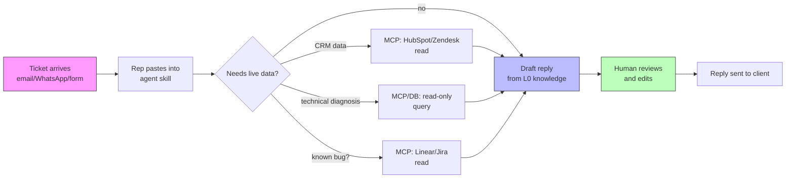

# Support & CSM Agent: Internal Ticket Triage and Account Diagnosis

> **Confidence**: Tier 3 (emerging pattern). Early-stage adoption reports positive results, but the maturity levels beyond L2 are largely undocumented in the field.

The commercial market for AI support agents (Decagon, Intercom Fin, Ada) targets one specific job: answer the client directly and deflect tickets before a human ever sees them. That is not what this pattern covers.

This page documents a different, complementary target: an **internal** Claude Code agent that sits next to a support or CSM team, not in front of the client. The agent reads the ticket, drafts a reply in the team's voice, and, once wired to the right MCP servers, checks the CRM and the product database before answering instead of the human doing that legwork by hand. The client never talks to it directly; a human always sends the final message.

Buy-side deflection tools and this pattern are not competitors. A team can run Intercom Fin or Decagon on the client-facing side while running an internal Claude agent for its own support reps. The internal agent is also the cheaper and faster thing to stand up, since it needs no vendor contract and no new tool for the team to learn, and it runs on Claude Code licenses a dev-adjacent team often already has.

---

## Table of Contents

1. [Core Concept](#core-concept)
2. [Maturity Model](#maturity-model)
3. [Flow](#flow)
4. [MCP Servers for This Pattern](#mcp-servers-for-this-pattern)
5. [Building the L0 Skill](#building-the-l0-skill)
6. [Security & Guardrails](#security--guardrails)
7. [Metrics to Track](#metrics-to-track)
8. [Anti-Patterns](#anti-patterns)
9. [Tools & Resources](#tools--resources)
10. [See Also](#see-also)

---

## Core Concept

Keep the boundary explicit from day one: this is an agent-assist pattern, not an autonomous client-facing chatbot. The distinction matters for two reasons.

First, scope of trust. A human reviews and sends every reply, and that single rule is what makes read/write access to production systems (CRM, database, issue tracker) an acceptable risk. The agent's output is always checked before it reaches a client, so a wrong diagnosis costs a few minutes of rework, not a bad client interaction.

Second, tooling. A client-facing chatbot needs a channel (web widget, WhatsApp, email inbox), session handling, and content moderation, which is Claude Agent SDK or API territory, not Claude Code CLI. An internal agent-assist tool is a Claude Code skill or a small script a support rep runs against a ticket. Much less to build, much faster to ship.

---

## Maturity Model

Six levels, each buildable independently. Most teams get real value by L1 or L2 and stop there for months before pushing further; there's no requirement to reach L5.

### L0: Reply drafting, no external access

A skill takes the raw ticket text (copy-pasted email, WhatsApp message, form submission) and produces a draft reply: diagnostic questions if the ticket is underspecified, or a full answer if the case matches a known pattern documented in the skill. No API calls, no live data, just the team's tone-of-voice and its catalog of recurring cases baked into the prompt.

Value at this level: faster drafting, consistent tone, and a spelling/grammar pass baked in for free. Ships in a few hours because it needs zero new access grants.

### L1: CRM read access via MCP

The agent connects to HubSpot or Zendesk (see [MCP servers](#mcp-servers-for-this-pattern) below) and can answer questions like "what's this client's plan," "when was their last ticket," or "is this contact already flagged as churn risk" without the rep switching tabs. Requires an API key or OAuth grant scoped to read-only where the vendor supports it.

### L2: Read-only database access for technical diagnosis

This is the level that turns a drafting tool into a diagnostic one. The agent gets read-only credentials to the product database (or, better, a replica) and can answer "why can't client X access their session" by checking account state, payment status, or feature flags directly, instead of escalating to engineering for a five-minute lookup.

This is also the level with the highest approval friction. It needs sign-off from whoever owns data access, and it should default to a **read replica**, never a primary connection, regardless of how "read-only" the grant looks on paper.

### L3: Issue tracker integration for known-bug awareness

Connect the agent to Linear or Jira (read-only) so it can recognize when a client's ticket matches an already-known, already-triaged bug and answer "this is a known issue, a fix is scheduled for [date]" instead of re-escalating a duplicate. See [event-driven-agents.md](./event-driven-agents.md) for the reverse direction of this integration: an agent that turns support signals into tracker tickets.

### L4: Contextual product/partner knowledge

Many B2B products integrate with third-party systems (ERPs, payment processors, SSO providers) that each have their own quirks. Ingest whatever documentation exists per integration (PDFs, API docs, internal notes) into a knowledge base the agent loads automatically when a ticket mentions that integration by name.

### L5: CSM pre-call briefing

Before a retention or upsell call, the agent pulls product usage data, ticket history, and CRM notes into a one-page brief covering what the account uses, what it doesn't, recent friction signals, and upsell angles. This is the step that turns 20 to 30 minutes of manual prep into something ready before the CSM opens their laptop. It needs L1 (CRM) and L2 (DB) already in place, plus CSM processes documented well enough to know what "usage signal" and "friction signal" mean for your product.

**Explicitly out of scope for this pattern**: client-facing chatbots and call-coaching/transcription tools (analyzing sales or CSM calls for talk-track quality). Both are real, valuable investments, but they're either buy-side products (see the intro) or built on different infrastructure (telephony/recording pipelines) than a Claude Code skill.

---

## Flow



The human-review step (H) is not optional and should not get automated away, even once the agent's accuracy looks good in practice. It's the control that lets you grant L2-level data access without turning every ticket into a production incident risk.

---

## MCP Servers for This Pattern

None of the servers below are published by Anthropic, HubSpot, or Zendesk themselves. Treat them as community tooling and re-verify maintenance status before depending on one in production. The official MCP Registry (`registry.modelcontextprotocol.io`) does list several self-published HubSpot/Zendesk entries, but registry presence just means someone submitted it, not that the vendor endorses it; see the [Customer Support & CRM section](../ecosystem/mcp-servers-ecosystem.md#customer-support--crm) for the full reasoning. The servers picked here were chosen by GitHub star count and commit recency instead.

| System | Server | Coverage | Notes |
|--------|--------|----------|-------|
| **HubSpot** | [`shinzo-labs/hubspot-mcp`](https://github.com/shinzo-labs/hubspot-mcp) | Contacts, companies, leads, deals, products, engagements, batch ops, associations (read/write) | Broadest object coverage of the community servers, tagged releases |
| **HubSpot** | [`baryhuang/mcp-hubspot`](https://github.com/baryhuang/mcp-hubspot) | Contacts, companies (read/write), conversation retrieval, semantic search over cached data | Highest star count; formerly at `peakmojo/mcp-hubspot` (old URL redirects) |
| **Zendesk** | [`reminia/zendesk-mcp-server`](https://github.com/reminia/zendesk-mcp-server) | Tickets, comments, Help Center articles | Most actively maintained of the Zendesk community options |
| **Linear** | Linear MCP | Issues, projects, comments, cycles | Already documented in [mcp-servers-ecosystem.md](../ecosystem/mcp-servers-ecosystem.md#linear-mcp); reuse that setup for L3 |

For the product database (L2), there is no generic MCP server to point at, since it depends entirely on your schema and stack. The common approach is a small custom MCP server (or even a thin read-only REST wrapper) exposing a handful of pre-written, parameterized queries rather than raw SQL access, so the agent can't construct an arbitrary query against production data.

---

## Building the L0 Skill

A minimal skill structure, generic enough to adapt to any team's tone and case catalog:

```markdown
---
name: agent-support
description: Drafts support ticket replies in the team's voice, using known recurring cases
---

# Support Reply Drafting

You draft replies to support tickets. You do not send anything: your output
is always reviewed by a human before it reaches the client.

## Process

1. Read the pasted ticket content (email, WhatsApp message, or form text).
2. Check it against the recurring cases below. If it matches one, draft a
   reply using that resolution.
3. If it doesn't match a known case, ask up to 3 diagnostic questions before
   drafting. Do not guess at a technical explanation you can't verify.
4. Match the tone: [team's tone-of-voice notes, e.g. direct, warm, no jargon]
5. Flag anything touching billing, data deletion, or security for escalation
   instead of drafting a reply.

## Recurring Cases

[Team fills this in from their own ticket history. This is the highest-value
part of the skill, and the one a generic template cannot write for you.]
```

The recurring-cases section is where most of the value lives, and it has to come from an export of the last 30 to 90 days of real tickets, grouped by category. Once L1/L2 access is added, the skill's instructions extend to call the relevant MCP tools instead of asking the rep to look things up manually.

---

## Security & Guardrails

- **Read-only, always, for L1 through L3.** No write access to the CRM, database, or issue tracker at these levels. If the agent needs to *update* a ticket status or CRM field, that's a deliberate, separate decision with its own review, not a default.
- **DB access via replica, not primary.** See [L2](#l2-read-only-database-access-for-technical-diagnosis) above. A replica bounds the blast radius of a bad query to a non-production system.
- **Least privilege on API keys.** Scope the HubSpot, Zendesk, or Linear credentials to the minimum object types the skill actually needs; most of these platforms support granular scopes.
- **PII handling.** Ticket content and CRM data both carry PII. Follow the data handling practices in [data-privacy.md](../security/data-privacy.md), and in particular don't let draft replies or diagnostic output land in logs or session transcripts that outlive the ticket.
- **Human-in-the-loop is the actual safety mechanism**, not a nice-to-have. Every level in this pattern assumes a person reads the output before it reaches a client. Don't wire the agent's draft directly to an auto-send action.

---

## Metrics to Track

This pattern doesn't produce a "deflection rate," since there's no client-facing surface being deflected. The metrics that matter are internal team throughput and quality, not volume avoided:

- **Draft-to-send edit distance**: how much a rep changes the draft before sending. A shrinking edit distance over time is the clearest signal the skill's case catalog is actually improving.
- **Time to first response**: from ticket arrival to reply sent. See [team-metrics.md](../ops/team-metrics.md) for how to track this alongside other team throughput metrics.
- **Escalation rate to engineering**: should drop once L2 (DB diagnosis) is in place, since a chunk of escalations exist only to get a data lookup a human couldn't do themselves.
- **CSM prep time** (once L5 is reached): time from "call is on the calendar" to "CSM has what they need," compared against the manual baseline.

---

## Anti-Patterns

| Anti-Pattern | Problem | Solution |
|-------------|---------|----------|
| **Skipping straight to L2 for the demo** | Data access approval takes weeks; a team that waits for it before shipping anything gets zero value in the meantime | Ship L0 first, since it needs no new access and still saves drafting time |
| **Auto-sending drafts** | Removes the one guardrail that makes L2-level access acceptable risk | Keep a human review step for every reply, permanently |
| **DB access via primary connection** | A bad query or a runaway agent loop can degrade production | Point at a read replica, always |
| **Generic case catalog copied from a template** | The team's actual recurring cases are specific to their product; a generic list produces generic, unhelpful drafts | Build the L0 case catalog from a real export of the team's own last 30 to 90 days of tickets |
| **Treating this as a chatbot project** | Conflates internal agent-assist (Claude Code skill) with client-facing deflection (SDK/API and vendor evaluation) | Decide which one you're building before scoping the work, see [Core Concept](#core-concept) |
| **No escalation flag for sensitive categories** | Billing disputes, data deletion requests, and security reports need a human from the start, not an AI-drafted reply | Bake an explicit escalation rule into the L0 skill for these categories |

---

## Tools & Resources

### MCP Servers

- [`shinzo-labs/hubspot-mcp`](https://github.com/shinzo-labs/hubspot-mcp): broadest HubSpot object coverage among community servers
- [`baryhuang/mcp-hubspot`](https://github.com/baryhuang/mcp-hubspot): highest-adoption HubSpot server (formerly `peakmojo/mcp-hubspot`)
- [`reminia/zendesk-mcp-server`](https://github.com/reminia/zendesk-mcp-server): tickets, comments, Help Center articles
- [Linear MCP](../ecosystem/mcp-servers-ecosystem.md#linear-mcp): already documented, reuse for L3

### Related Reading

- [MCP Servers Ecosystem](../ecosystem/mcp-servers-ecosystem.md): evaluation framework to apply to any new server before adoption
- [MCP vs CLI Decision Guide](../ecosystem/mcp-vs-cli.md): whether a given integration should be an MCP server or a simpler CLI/script

---

## See Also

- [event-driven-agents.md](./event-driven-agents.md): trigger tracker updates from support signals, the reverse integration direction
- [mcp-servers-ecosystem.md](../ecosystem/mcp-servers-ecosystem.md): evaluation framework and Linear MCP setup
- [data-privacy.md](../security/data-privacy.md): PII handling practices referenced in [Security & Guardrails](#security--guardrails)
- [team-metrics.md](../ops/team-metrics.md): throughput metrics referenced in [Metrics to Track](#metrics-to-track)
